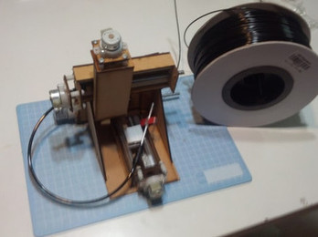
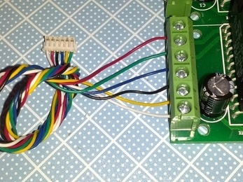
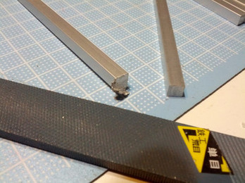
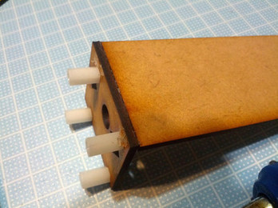
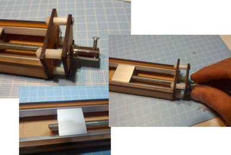

# ATTSBOXマニュアル

## ATTSBOXについて

 ATTSBOXを手にとって頂き，ありがとうございます． ATTSBOXは自分で組み立ててArduinoで制御する３軸NCマシンです，プログラムで簡単に位置制御ができるNCとして，教材等としてご使用下さい． 尚，このキットをNCとして動作させるには別途電源装置とArduinoが必要ですので，予めご了承下さい．

## 概要説明

ATSBOX( ATomable Tranning Sandbox )は教育向けの汎用3軸ステージです。 
以下の特徴があります。
 
  - とても小さい
    - 家庭の邪魔にならない。
  - 様々に応用できる
    - 3Dプリンタ、レーザーカッター、コーヒーアート、プロッタ、などなどCNCなどは無理ですが、力のかからないものは何でも！
  - 拡張性が高い
    - 付属のモータドライバは10万円以上する3Dプリンタのコントローラよりも大容量です。モータを取り換えて大出力に、精度を詰めてみる、速度を上げてみる・・・。簡単な構造で、作り変えなども自在！
  - 簡単に製作できる
    - 従来の3軸ステージよりはるかに簡単に組立ができます。小学生でも組み立てられるようにしたかったのですが、はんだづけとスライダのねじ切りはちょっと苦しいかな・・・。
  - 技術的特徴
    - メカ的には小さいこと、小さいことで荷重、熱応力などが小さくでき、アルミスリーブレールやISOねじによる転造スライダが使えるようになったことで価格の劇的な低減を行っています。
 
今までArduinoなどの電子工作教材として、LEDやセンサー、音の次のステップとして動くものを目指したのですがいきなりロボット教材など、難易度も価格もとても敷居が高いものでした。難易度を下げ、価格を最終的に1万円程度とし、 なおかつ面白い教材としてスタンダードとなることができるようにならないかと思っています。また、3軸ステージは思った位置に数値通りに止まるメカとなり、様々な実用ガジェットを作る素材となるのではないかと期待しています。

## 用意するもの
 
キットの他に工具、電源、Arduino、PC、回路ケースなどが必要となります。

### 電源について

どうして電源がついてないの？ 
 
これに必要な電源は12V 2Aです。
安全に動かしたい場合は12V、リミットを外して動かしたい場合は
15V、更に例えば3Dプリンタにする場合は5A程度の電源が必要となります。
用途によって電源は異なることから、電源は別売りとしました。

### 回路ケース

基板を固定するケースがついていません。裸のままなので、適宜
ケースや板に固定してください。なお、動作設定によっては
発熱する場合があるので放熱板などを取り付けてください。

### Arduino

このキットはArduino互換機AKBONE実験キットとセットとして使うことを推奨しています。
それ以外のArduinoまたはArduino互換機を使う場合は、ジャンパーケーブルを
用意してください。

### 工具

ホットボンド、#2ドライバ、#1ドライバ、1.5mmレンチ、はんだ、はんだごて、やすり、グリス、ニッパー
できればM6タップ

## 基板の製作

ステッピングモーターのドライバ基板ですが、同じものが4連つながっています。

このうち3つを組み立てます。残り1つはオプションのエクストルーダーを取り付けるときに使用します。
まず、1つを組み立てて動作確認しましょう。
うまくいったら次の2つを組み立てます。
チャンネルごとは写真のように連結します。

 
写真のようにSTEPおよびDIRの信号をArduinoから入力します。

 
ドライバの色は図のようになります。これはFABLIB用の標準配置ですが、
使用しているコパル製のモーターに付属しているの配線の色配置とは一部異なっています。
モーター配線とは写真のように接続してください。

 
<!-- 写真は後ほど5枚追加 -->

## ソフトウェアの案内

ソフトウェアは、Arduinoから向きの信号およびパルスを送るだけで
制御できます。
一番簡単なのはBlinkを改良してパルスをモータに送ることです。
Blinkはdelay(1000)としてました。モータには、delayMicrosedondsを
使います。delayMicroseconds(900)ぐらいがいいようです。
また、Ardublockで簡単に制御のチャレンジをしてみましょう！
 
 
ATTSBOXを3Dプリンタとして使うとすれば、ソフトをどうすればいいのでしょうか。
以下のものが必要となります。
 
- STLファイルをG-codeに直すソフト（PC上のスライサ）
- G-codeをArduinoに送るソフト（PC上のCAM）
- Arduinoからモータドライバを駆動するソフト(Arduino上のファームウェア)
 
オープンフォースでは、スライサとしてSlic3r、
http://reprap.org/wiki/Slic3r
CAMとしてPrintrun、
http://reprap.org/wiki/Printrun
ファームウェアとしてGrbr
http://reprap.org/wiki/List_of_Firmware#Grbl
を推奨しています。
 
また、3Dデータとして、STLファイルを用意してください。
STLファイルを作るテクニックはこちらを参考にしてください。
https://github.com/yamamurasyunsuke/3D-Design-On-The-Open-Highway/wiki/3D-Design-On-The-Open-Highway

## 拡張工作の手引き

### ワークエリアを大きくしたい
 
搬送レールは以下の部材で構成されています。
同じ部材を購入し、長いサイズに置き換えることによってワークエリアを大きくすることができます。（筐体もそれにあわせて大きくする必要があります）

- 4x4mmのアルミ角棒
- 25mm幅のアルミHチャネル(アルミハカマ)
- M6の寸切りネジ
 
### 3Dプリンタにしたい

ホットエンド、エクストルーダーを取り付けると3Dプリンタとすることができます。
ATTSBOX専用のホットエンド、エクストルーダーは開発中ですが、
テスト中のエクストルーダーはオプションで購入できます。
また、ホットエンドはCell3Pのものを取り付けることができます。（要工夫）
冊子の最後に、3Dプリンタの製作例を載せていますので、是非ご覧下さい<!-- 勝手に追加しました、すみません -->

### モーターを大きくしたい

このドライバ基板にあわせたものとする場合は、ユニポーラ型の
ステッピングモータを使ってください。

### もっと大出力にしたい

このドライバ基板には、サンケンのSLA7070MPRTが使われています。
1A流せますが、もっとパワーアップしたいときは同じサンケンの
SLA7073MPRTに差し替えることができ、こちらは3A流すことができます。
また、電源は12Vを使っていますがモータドライバIC自体は44Vまで
加えることができます。
なお、モータードライバの発熱が大きくなるのでその場合は
モータードライバに放熱器を取り付けてください。
モータードライバ以外の部品を裏面に取り付け、モータードライバを寝かすレイアウトがお勧めです。

<!-- togetterの転載はじめ -->
# ちっちゃい3軸ステージATTSBOXのつくり方

Arduinoでコントロールできる数値制御トレーニングキット。3Dプリンタを目指してGo!。
元の解説ページはtogetter(http://togetter.com/li/609192)を見て下さいね。

> tasboxがLIXILトステムの商品にあったので改めattsbox。fablib の名前付け時もLIXILはどうかな→被ってる という過去があり正に因縁。3Dプリンタ用に仮組してみた。ヘッドがまだできてない…

> コミケ3日目に頒布予定の#ATTSBOXキット。組み立て説明連ツイします。自分で組み立てる3軸NCマシンでステッピングモーターをArduinoから制御します。プログラムで簡単に位置制御ができる教材を目指しています。

> コミケバージョンキットに含まれるのは3軸制御部分だけで、電源、Arduinoを別に購入ください。また写真のオプションをつけるとエクストルーダーが使えるようになります。これにフィラメント、ホットエンドをつけると3Dプリンタに。

> キットのMDFボード。レーザーカッターで切り目を入れてあります。焦げ跡がありますがキニシナイ！好きな色に塗装してから組み立てるのもいいでしょう。

> パーツ配置はこのようになります。先に全部切り離すのではなく、必要な部分のみを切り出すのがいいでしょう。

> よく切れるカッターで切り抜いていきます。工作マットを敷いて机を傷つけないようにしましょう。

> 金属パーツです。キットに入っているジョイントは写真バージョン進化して形が違うものになりました。

> 金属パーツは荒切りしたままなので、ヤスリでささくれ等をきれいにして、成形します。

> 寸切りねじは、一方の端を写真のようにやすっておきます。

> ホットボンドを写真の位置に塗って

> 貼り合わせます。接着剤ははみ出ても固まりかけのときに手で取るときれいになります。

> 反対側は向きを注意して、貼り合わせます。

> M6タップを持っている人はここでスライダにねじを切ります。なるべく隔壁に寄せてまっすぐになるように気を付けて。ネジ山を100%完成する必要はありません。80%程度でOKです。タップ持ってない人は後でネジを切ります。

> レールとスライダを取り付けます。レールは内側に抑えながらホットボンドで止めます。スライダがガタが無く動く程度にきつくしてください。

> 側面の板を両側に取り付けます。接着剤はいっぱい使用してください。その後モーターブラケットを取り付けます。

> 100mmの寸切りネジをねじ込みます。ジョイントを写真のようにジョイントをつけ、グリスをつけてねじ込んでいきます。先にタップを使っていない方はここでちょっと大変…少しずつ何度も往復して貫通してください。まっすぐになるように注意。

> ナイロンチューブ（太）を20mm、（細）を15mm程度に切ります。ジョイントを一旦外して（太）をセット。（細）はモーター軸に被せます。ジョイントをレールフレーム内部にセットした後にモーター強く押し込み、ホットボンドでを接着。

> これでz軸が完成しました。同じようにして、x軸とy軸を作ります。x軸は20mm長くなります。

> 筐体を作ります。底面にホットボンドで側面を取り付けます。その後天井と三角板を取り付けます。ぐらつかないようにしっかり止めましょう。

> 裏面に補強板を2枚、底面にY軸ガイドを取り付けます。

> X軸（長い軸）のスライダを2階建てにします。Z軸のスライダと直角に接着し、フレームに取り付けます。

> Y軸のスライダを2階建てにします。鏡のカバーを折り取り、スライダに載せます。鏡の位置およびY軸の位置を調整しながら、それぞれ接着します。位置はZ軸に何のヘッドを載せるかで調整してください。

> 配線をして、試運転をします。写真に接続しているのはFABLIB製の4連LIBLOSTEP。うまく動かない場合は、補強やグリスアップ、スライダの慣らしを行います。

